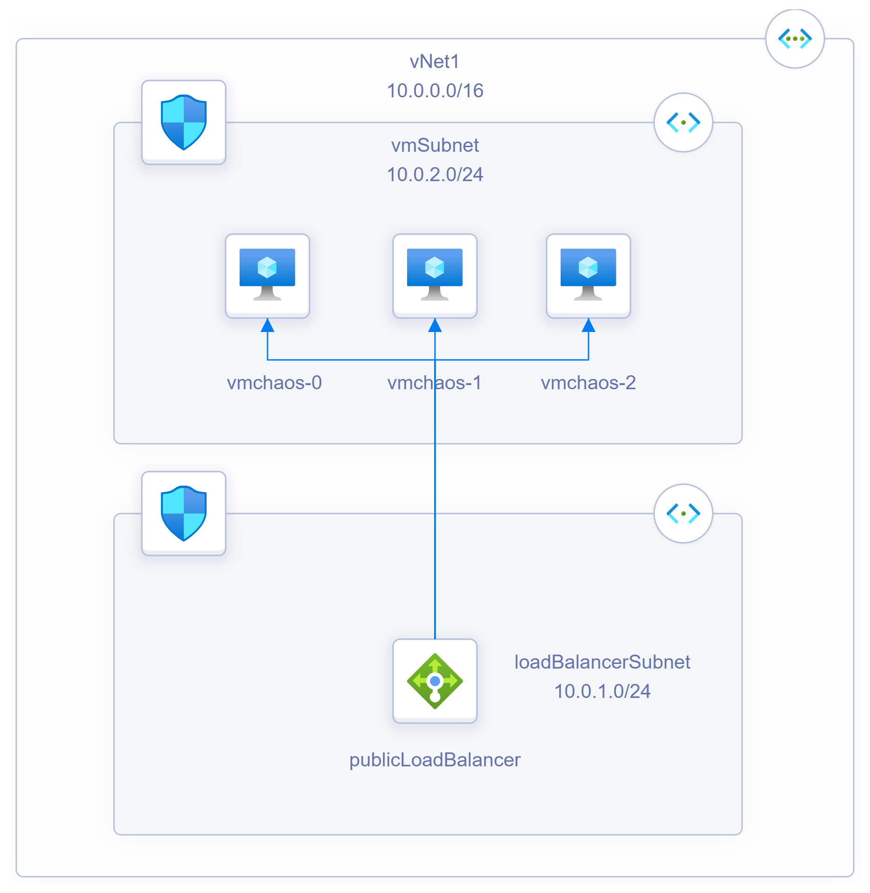

# Chaos Studio Hack

## Overview

## Hack Architectures

| Name     | Despriction                                          | Deploy                                                                                              |
| -------- | -----------------------------------------------------| ----------------------------------------------------                                                |
| Monkey   | IIS Web Servers with Public Load Balancer Front End  | <ahref="https://portal.azure.com/#create/Microsoft.Template/uri/https%3A%2F%2Fraw.githubusercontent.com%2Fnicolalgallacher%2FChaosStudioHack%2Fmain%2Fmain.bicep%3Ftoken%3DGHSAT0AAAAAABYHQFMTBRKEZWRHAS4CY4FIYY3KA2A" target="_blank">
   
</a> 

### Monkey Architecture Diagram
 
 
## Hypothesize
What outages can you think have that may effect this architecture? 
How do you think the current architecture would handle a High Availability outage?
## Experiment  
Break the system! :D 
## Analyze
Did the architecture handle the outage in the way you thought? 
Was there a full outage or was the architecture able to stay running? 
## Improve 
How would you improve the architecture based on your experiment results? 
