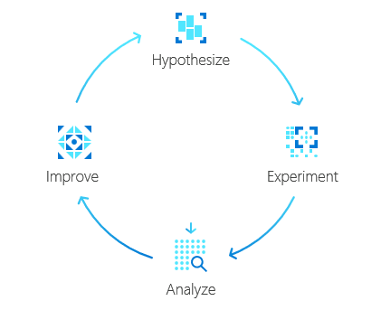

# Chaos Studio Hack

## Overview

Welcome to this Chaos Studio Hack, where we will allow you to deploy Chaos Experiments on pre-built architectures!

We will be following the iterative process below as the base for the activities we will be carrying out: 

  

### Hack Pre Requsists 
- Ensure that you have an Azure Subscription that you can deploy resources into 
- An intermediate understanding of the Azure resources
- Ideally choose the Architecture you want to work with in Step 1 prior to the hack and have it deployed beforehand. 

## Step 1: Hack Architectures

### Deploy your Architecture
Please select a base architecture example you would like to work with from the descriptions below: 

| Name     | Despriction                                          | Details | Deploy                              |     
| -------- | -----------------------------------------------------| --------|---------------------------          |
| Monkey   | IIS Web Servers with Public Load Balancer Front End  | [Design](monkey.md)        |Run 'deployMonkey.ps1' to deploy in your subscription                                |
| More Coming Soon! | [How to Contribute](Contribute.md)

 
You will be asked to enter the location you want to deploy your architecture to when you run the deployment.
 
Once the deployment is complete you should be able to see all of the resources within the "ChaosHack" Resource Group. Ensure that the deployment has completed successfully before moving on. 

## Step 2: Hypothesize

### Explore your base Architecture 
Take some time to understand the architecture that has been deployed, what resources have been deployed and how the interact with each other. How do the resources respond when everything is running normally? 

### Create Hypothisis 
What outages can you think have that may effect this architecture? 
How do you think the current architecture would handle an outage?

**Write down 5 examples of what may happen and how you expect the current architecture to handle the situation.**

## Step 3: Experiment!  
This is where Chaos Studio comes in!

Look at your 5 Hypothisis from the previous task. 

Compare this with the list of avialable faults that can be produced from Chaos Studio: 
  - Supported Resources: https://docs.microsoft.com/en-us/azure/chaos-studio/chaos-studio-fault-providers
  - Faults and Actions: https://docs.microsoft.com/en-us/azure/chaos-studio/chaos-studio-fault-library

Choose one of your Hypothisis and create a Chaos Experiment that can replicate the effects: 
  - Create an Experiment: https://docs.microsoft.com/en-us/azure/chaos-studio/chaos-studio-quickstart-azure-portal
  - High CPU Experiment https://gallinthecloud.com/p/chaos-studio-overview/
  - Chaos Mesh & AKS Faults: https://docs.microsoft.com/en-us/azure/chaos-studio/chaos-studio-tutorial-aks-portal

## Step 4: Analyze
Did the architecture handle the outage in the way you thought? 
Was there a full outage or was the architecture able to stay running? 

**Write a brief summary of how the architecture preformed during the experiment compared to what you had hypothesised**

## Step 5: Improve 
How would you improve the architecture based on your experiment results? 
Woudl other teams have been aware the experiment was running if this was deployed in a production environment? 

**Think of 5 improvements you would make to the architecture, implement any changes you think you can to improve High Avilability and Monitoring**

## Clean Up 
Ensure that you delete any un needed resources once you have completed the hack 
